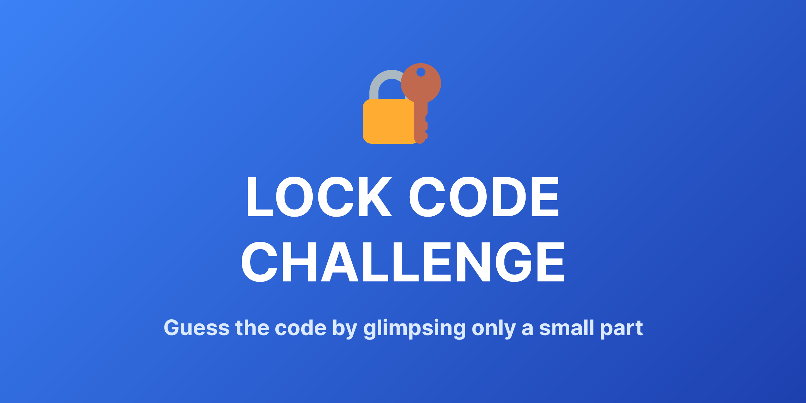

# 🔐 Lock Code Challenge

A memory puzzle game where you must guess a 3-digit code by glimpsing only a small part of each number.

🎮 **[Play now](https://lock.inigochoa.me)**



## ✨ Features

- 🧠 Test your memory and observation skills
- ⚡ Fast-paced gameplay with instant feedback
- 📊 Track your streak and high score
- ⌨️ Keyboard and touch support
- 🌐 Fully responsive design
- 🎨 Clean, minimalist interface

## 🛠️ Built With

- [Astro 5](https://astro.build) - Web framework
- [Tailwind CSS 4](https://tailwindcss.com) - Styling
- TypeScript - Type safety
- GitHub Actions - CI/CD

## 🚀 Development
```bash
# Install dependencies
pnpm install

# Start dev server
pnpm dev

# Build for production
pnpm build

# Preview production build
pnpm preview
```

## 📝 License

MIT © [Iñigo Ochoa](https://inigochoa.me)
